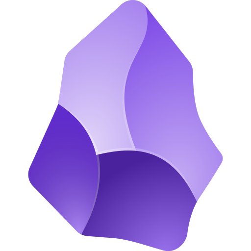
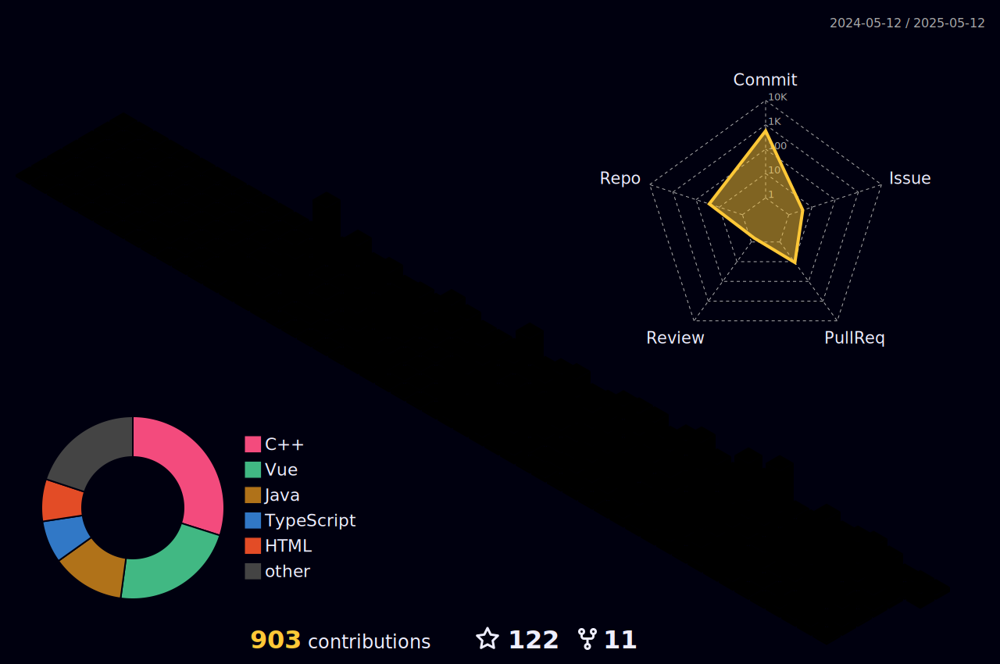

```

    ____  _                        __    ___           _____           ____           
   /  _/ ( )   ____ ___           / /   <  /   ____   / ___/   ____   / __ \ _      __
   / /   |/   / __ `__ \         / /    / /   / __ \  \__ \   / __ \ / / / /| | /| / /
 _/ /        / / / / / /        / /___ / /   / / / / ___/ /  / / / // /_/ / | |/ |/ / 
/___/       /_/ /_/ /_/        /_____//_/   /_/ /_/ /____/  /_/ /_/ \____/  |__/|__/  
                                                                                      
                                          

```
##


# 👋 Hi! I'm L1nSn0w.

# 👨‍💻 More About Me

🤠 He / Him . 21-year-old.

🎈 Based in `China`
  
🤔 Languages: Native in `Chinese`, conversational in `English`

🌏 Marjor in `Software Engineer` at the `GDUT`(Guangdong University of Technology)

🛟 Enjoys surfing the `web` and discovering interesting and innovative software.

💻 `Full-stack` development enthusiast

🎮 Enjoys playing `The Finals`

🗣️ Enjoys discussing `interests` and `tech` with others

👾 Love Products and Design From `Apple. Inc` && `Google. Inc`  

🤪 ...

# 📫 Contact With Me:

✉️ Email: aGlAbGluc25vdy5jbg==

🙃 L1nSn0w: [L1nSn0w's Site](https://linsnow.cn)

😋 Soopy: [Soopy](https://soopy.cn)

🌀 ...

# 🔮 Tools


<!--  -->

<!-- 
      ... -->

# 🍟 Stats

<div style="text-align: center;">
    <a href="https://github.com/lin-snow">
        
    </a>
    <a href="https://github.com/lin-snow">
        
    </a>
</div>

<!--START_SECTION:waka-->


**🐱 My GitHub Data** 

> 📦 564.1 kB Used in GitHub's Storage 
 > 
> 🏆 0 Contributions in the Year 2025
 > 
> 💼 Opted to Hire
 > 
> 📜 38 Public Repositories 
 > 
> 🔑 12 Private Repositories 
 > 
**I'm a Night 🦉** 

```text
🌞 Morning                27 commits          █░░░░░░░░░░░░░░░░░░░░░░░░   05.36 % 
🌆 Daytime                165 commits         ████████░░░░░░░░░░░░░░░░░   32.74 % 
🌃 Evening                297 commits         ███████████████░░░░░░░░░░   58.93 % 
🌙 Night                  15 commits          █░░░░░░░░░░░░░░░░░░░░░░░░   02.98 % 
```
📅 **I'm Most Productive on Friday** 

```text
Monday                   77 commits          ████░░░░░░░░░░░░░░░░░░░░░   15.28 % 
Tuesday                  59 commits          ███░░░░░░░░░░░░░░░░░░░░░░   11.71 % 
Wednesday                65 commits          ███░░░░░░░░░░░░░░░░░░░░░░   12.90 % 
Thursday                 74 commits          ████░░░░░░░░░░░░░░░░░░░░░   14.68 % 
Friday                   86 commits          ████░░░░░░░░░░░░░░░░░░░░░   17.06 % 
Saturday                 68 commits          ███░░░░░░░░░░░░░░░░░░░░░░   13.49 % 
Sunday                   75 commits          ████░░░░░░░░░░░░░░░░░░░░░   14.88 % 
```


📊 **This Week I Spent My Time On** 

```text
🕑︎ Time Zone: Asia/Shanghai

💬 Programming Languages: 
Vue.js                   17 hrs 12 mins      █████████████░░░░░░░░░░░░   50.73 % 
TypeScript               6 hrs 33 mins       █████░░░░░░░░░░░░░░░░░░░░   19.33 % 
Java                     4 hrs 25 mins       ███░░░░░░░░░░░░░░░░░░░░░░   13.05 % 
YAML                     2 hrs 10 mins       ██░░░░░░░░░░░░░░░░░░░░░░░   06.42 % 
Docker                   1 hr 7 mins         █░░░░░░░░░░░░░░░░░░░░░░░░   03.30 % 

🔥 Editors: 
VS Code                  29 hrs 42 mins      ██████████████████████░░░   87.52 % 
IntelliJ IDEA            4 hrs 14 mins       ███░░░░░░░░░░░░░░░░░░░░░░   12.48 % 

🐱‍💻 Projects: 
Tika-Web                 26 hrs 25 mins      ███████████████████░░░░░░   77.88 % 
Tika                     5 hrs 14 mins       ████░░░░░░░░░░░░░░░░░░░░░   15.42 % 
Tika-Backend             1 hr 21 mins        █░░░░░░░░░░░░░░░░░░░░░░░░   04.00 % 
sky-take-out             51 mins             █░░░░░░░░░░░░░░░░░░░░░░░░   02.52 % 
linsnow                  2 mins              ░░░░░░░░░░░░░░░░░░░░░░░░░   00.10 % 

💻 Operating System: 
Windows                  33 hrs 56 mins      █████████████████████████   100.00 % 
```

**I Mostly Code in HTML** 

```text
HTML                     9 repos             ███████░░░░░░░░░░░░░░░░░░   29.03 % 
JavaScript               4 repos             ███░░░░░░░░░░░░░░░░░░░░░░   12.90 % 
TypeScript               4 repos             ███░░░░░░░░░░░░░░░░░░░░░░   12.90 % 
Java                     3 repos             ██░░░░░░░░░░░░░░░░░░░░░░░   09.68 % 
C++                      2 repos             ██░░░░░░░░░░░░░░░░░░░░░░░   06.45 % 
```


**Timeline**


 Last Updated on 05/02/2025 18:43:15 UTC
<!--END_SECTION:waka-->


---
##

