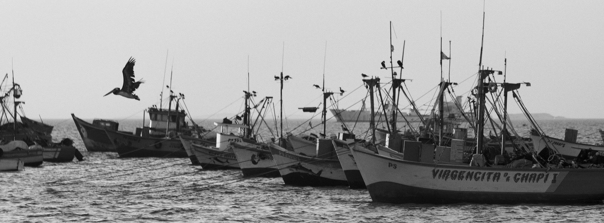

<picture>
  <source media="(prefers-color-scheme: dark)" srcset="assets/wordmark-dark.svg" />
  
</picture>

*Full-stack Developer · Cloud Native & AI Agent · 无限进步*

   

  

He / Him · 22 · Software Engineering at **GDUT**, based in **China**. A **full-stack** developer now focused on **Cloud Native** and **AI Agent** development — native Chinese, conversational English, forever hunting down interesting software, talking tech with anyone curious, playing *The Finals*, and admiring what **Apple** and **Google** ship.

<a href="https://ghfind.com/u/lin-snow?ref=badge">
  <picture>
    <source media="(prefers-color-scheme: dark)" srcset="https://ghfind.com/api/card/mini/lin-snow?variant=radar&theme=dark&lang=zh" />
    
  </picture>
</a>

