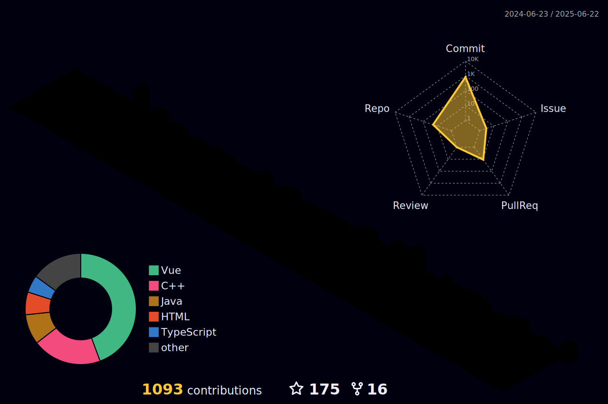

```

    ____  _                        __    ___           _____           ____           
   /  _/ ( )   ____ ___           / /   <  /   ____   / ___/   ____   / __ \ _      __
   / /   |/   / __ `__ \         / /    / /   / __ \  \__ \   / __ \ / / / /| | /| / /
 _/ /        / / / / / /        / /___ / /   / / / / ___/ /  / / / // /_/ / | |/ |/ / 
/___/       /_/ /_/ /_/        /_____//_/   /_/ /_/ /____/  /_/ /_/ \____/  |__/|__/  
                                                                                      
                                          

```

---

##


# 👋 Hi! I'm L1nSn0w.

# 👨‍💻 More About Me

🤠 He / Him . 21-year-old.

🎈 Based in `China`
  
🤔 Languages: Native in `Chinese`, conversational in `English`

🌏 Marjor in `Software Engineer` at the `GDUT`(Guangdong University of Technology)

🛟 Enjoys surfing the `web` and discovering interesting and innovative software.

💻 `Full-stack` development enthusiast

🎮 Enjoys playing `The Finals`

🗣️ Enjoys discussing `interests` and `tech` with others

👾 Love Products and Design From `Apple. Inc` && `Google. Inc`  

🤪 ...

---

# 📫 Contact With Me:

✉️ Email: aGlAbGluc25vdy5jbg==

🙃 [L1nSn0w の 小窝](https://linsnow.cn)

😋 [Soopy~](https://soopy.cn)

🌀 ...

---

# 🔮 Skills & Tools


---

# 🍟 Stats


<!-- <div style="text-align: center;">
    <a href="https://github.com/lin-snow">
        
    </a>
    <a href="https://github.com/lin-snow">
        
    </a>
</div> -->

---

# 🏆 Contribution


---

# ⏲️ Waka Time

<!--START_SECTION:waka-->


**🐱 My GitHub Data** 

> 📦 869.2 kB Used in GitHub's Storage 
 > 
> 💼 Opted to Hire
 > 
> 📜 46 Public Repositories 
 > 
> 🔑 14 Private Repositories 
 > 
**I'm a Night 🦉** 

```text
🌞 Morning                106 commits         ██░░░░░░░░░░░░░░░░░░░░░░░   09.96 % 
🌆 Daytime                389 commits         █████████░░░░░░░░░░░░░░░░   36.56 % 
🌃 Evening                507 commits         ████████████░░░░░░░░░░░░░   47.65 % 
🌙 Night                  62 commits          █░░░░░░░░░░░░░░░░░░░░░░░░   05.83 % 
```
📅 **I'm Most Productive on Monday** 

```text
Monday                   181 commits         ████░░░░░░░░░░░░░░░░░░░░░   17.01 % 
Tuesday                  147 commits         ███░░░░░░░░░░░░░░░░░░░░░░   13.82 % 
Wednesday                142 commits         ███░░░░░░░░░░░░░░░░░░░░░░   13.35 % 
Thursday                 121 commits         ███░░░░░░░░░░░░░░░░░░░░░░   11.37 % 
Friday                   172 commits         ████░░░░░░░░░░░░░░░░░░░░░   16.17 % 
Saturday                 137 commits         ███░░░░░░░░░░░░░░░░░░░░░░   12.88 % 
Sunday                   164 commits         ████░░░░░░░░░░░░░░░░░░░░░   15.41 % 
```


📊 **This Week I Spent My Time On** 

```text
🕑︎ Time Zone: Asia/Shanghai

💬 Programming Languages: 
Vue.js                   11 hrs 3 mins       ███████████░░░░░░░░░░░░░░   44.14 % 
Go                       5 hrs 44 mins       ██████░░░░░░░░░░░░░░░░░░░   22.89 % 
Markdown                 2 hrs 31 mins       ███░░░░░░░░░░░░░░░░░░░░░░   10.06 % 
C                        1 hr 24 mins        █░░░░░░░░░░░░░░░░░░░░░░░░   05.63 % 
TypeScript               1 hr 21 mins        █░░░░░░░░░░░░░░░░░░░░░░░░   05.40 % 

🔥 Editors: 
VS Code                  25 hrs 3 mins       █████████████████████████   100.00 % 

🐱‍💻 Projects: 
Ech0                     19 hrs 52 mins      ████████████████████░░░░░   79.29 % 
source                   2 hrs 36 mins       ███░░░░░░░░░░░░░░░░░░░░░░   10.44 % 
2                        1 hr 24 mins        █░░░░░░░░░░░░░░░░░░░░░░░░   05.62 % 
OS                       48 mins             █░░░░░░░░░░░░░░░░░░░░░░░░   03.24 % 
linsnow                  11 mins             ░░░░░░░░░░░░░░░░░░░░░░░░░   00.74 % 

💻 Operating System: 
Windows                  25 hrs 3 mins       █████████████████████████   100.00 % 
```

**I Mostly Code in JavaScript** 

```text
JavaScript               7 repos             ████░░░░░░░░░░░░░░░░░░░░░   17.07 % 
Java                     5 repos             ███░░░░░░░░░░░░░░░░░░░░░░   12.20 % 
TypeScript               4 repos             ██░░░░░░░░░░░░░░░░░░░░░░░   09.76 % 
C++                      3 repos             ██░░░░░░░░░░░░░░░░░░░░░░░   07.32 % 
CSS                      2 repos             █░░░░░░░░░░░░░░░░░░░░░░░░   04.88 % 
```


**Timeline**


 Last Updated on 27/05/2025 18:49:49 UTC
<!--END_SECTION:waka-->


---
##

